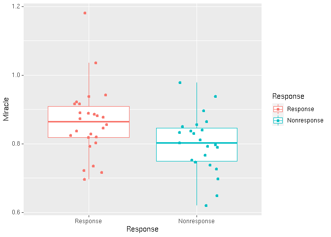

Calculating MIRACLE Score from Bulk Gene Expression Datasets
================
Tolga Turan
June 14, 2019

INTRODUCTION:
-------------

**MIRACLE** is short for "**M**ediators of **I**mmune **R**esponse **A**gainst **C**ancer in so**L**id micro**E**nvironments". The genesets are generated using a straigthforward approach as explained in the associated publication. Briefly, the cohorts where immune infiltrate has good prognosis association as well as the ones with opposite prognosis association are used as training sets. The markers generated by the training samples are used to calculate single-sample GeneSet Enrichment (ssGSE) scores and mathematical ratio of ssGSE scores of good prognosis cohorts to worse prognosis cohorts gives Miracle Score.

INSTALLATION:
-------------

First install the latest version of the dependency package "yaGST":

``` {.r}
library(devtools)
install_github("miccec/yaGST")
```

Then install Miracle as follows:

``` {.r}
library(devtools)
install_github("tolgaturan-github/Miracle")
```

USAGE:
------

To calculate Miracle score, use a gene expression matrix normalized by methods including but not limited to EDASeq for RNA-seq or Quantile or RMA for Microarrays.

Please note that Miracle has not been tested on Nanostring platforms or RNAseq RPKM or FPKM normalizations.

The accepted feature\_identifiers are "ens" for Ensemble Gene Ids; "u133p2" for Affymetrix U133p2 or U133A probe\_ids; "entrez" for Entrez Gene Ids; "gene" for Gene Symbols and "ilmn" for IlluminaHT12v3 or IlluminaHT12v4 microarray platforms.

### Example1: Calculating Miracle Scores and Measuring Survival Association in TCGA-BLCA:

*Please note that this vignette makes use of "ggplot2" and "survival" packages which are not necessary for installation but necessary to replicate this vignette.*

Load normalized gene expression and Survival Data for TCGA-BLCA

``` {.r}
library(survival)
library(ggplot2)
library(Miracle)
data("SURV_BLCA","TCGA_BLCA_EDASeq_norm",package="Miracle") 
head(SURV_BLCA)
```

    ##              ID Time Status
    ## 8  TCGA-FD-A3B6 1005   TRUE
    ## 10 TCGA-FD-A3B3  974   TRUE
    ## 11 TCGA-DK-A3IU  706   TRUE
    ## 14 TCGA-XF-AAN2 1869   TRUE
    ## 15 TCGA-FD-A43Y  474   TRUE
    ## 19 TCGA-ZF-A9RN  615   TRUE

``` {.r}
TCGA_BLCA_EDASeq_norm[1:5, 1:5]
```

    ##                 TCGA-FD-A3B6 TCGA-FD-A3B3 TCGA-DK-A3IU TCGA-XF-AAN2
    ## ENSG00000000003        11.81        11.05         9.69        11.42
    ## ENSG00000000005         0.00         3.52         1.00         2.96
    ## ENSG00000000419        11.40        11.08        11.46        11.30
    ## ENSG00000000457         9.10         8.98         9.54         9.50
    ## ENSG00000000460         9.52         9.50         9.35         9.21
    ##                 TCGA-FD-A43Y
    ## ENSG00000000003        11.70
    ## ENSG00000000005         0.00
    ## ENSG00000000419        11.66
    ## ENSG00000000457         9.66
    ## ENSG00000000460         9.13

Calculate ICR and Miracle Scores and merge with survival data:

``` {.r}
TCGA_ICR_and_miracle_scores<-Calculate_Miracle(TCGA_BLCA_EDASeq_norm, "ens")
```

``` {.r}
head(TCGA_ICR_and_miracle_scores)
```

    ##                    ICR IE_Specific ID_Specific   Miracle
    ## TCGA-FD-A3B6 0.9542586   0.6648479   0.7237434 0.9186238
    ## TCGA-FD-A3B3 0.9687819   0.7193332   0.7941730 0.9057638
    ## TCGA-DK-A3IU 0.9796718   0.7208531   0.7727721 0.9328145
    ## TCGA-XF-AAN2 0.9059568   0.6154979   0.6854360 0.8979655
    ## TCGA-FD-A43Y 0.7724496   0.6112264   0.7519228 0.8128846
    ## TCGA-ZF-A9RN 0.9280430   0.6243175   0.6865843 0.9093093

``` {.r}
all(rownames(TCGA_ICR_and_miracle_scores)==SURV_BLCA[,1])
```

    ## [1] TRUE

``` {.r}
TCGA_BLCA_Miracle_SURV<-cbind(SURV_BLCA, TCGA_ICR_and_miracle_scores)
head(TCGA_BLCA_Miracle_SURV)
```

    ##              ID Time Status       ICR IE_Specific ID_Specific   Miracle
    ## 8  TCGA-FD-A3B6 1005   TRUE 0.9542586   0.6648479   0.7237434 0.9186238
    ## 10 TCGA-FD-A3B3  974   TRUE 0.9687819   0.7193332   0.7941730 0.9057638
    ## 11 TCGA-DK-A3IU  706   TRUE 0.9796718   0.7208531   0.7727721 0.9328145
    ## 14 TCGA-XF-AAN2 1869   TRUE 0.9059568   0.6154979   0.6854360 0.8979655
    ## 15 TCGA-FD-A43Y  474   TRUE 0.7724496   0.6112264   0.7519228 0.8128846
    ## 19 TCGA-ZF-A9RN  615   TRUE 0.9280430   0.6243175   0.6865843 0.9093093

Calculate Survival association of ICR in TCGA\_BLCA Cohort:

``` {.r}
coxph(Surv(Time, Status)~ICR, data=TCGA_BLCA_Miracle_SURV)
```

    ## Call:
    ## coxph(formula = Surv(Time, Status) ~ ICR, data = TCGA_BLCA_Miracle_SURV)
    ## 
    ##        coef exp(coef) se(coef)      z     p
    ## ICR -0.2723    0.7616   0.2201 -1.237 0.216
    ## 
    ## Likelihood ratio test=1.54  on 1 df, p=0.2154
    ## n= 405, number of events= 178

Calculate Survival association of Miracle in TCGA\_BLCA Cohort:

``` {.r}
coxph(Surv(Time, Status)~Miracle, data=TCGA_BLCA_Miracle_SURV)
```

    ## Call:
    ## coxph(formula = Surv(Time, Status) ~ Miracle, data = TCGA_BLCA_Miracle_SURV)
    ## 
    ##             coef exp(coef) se(coef)      z        p
    ## Miracle -4.81840   0.00808  1.05540 -4.565 4.98e-06
    ## 
    ## Likelihood ratio test=22.36  on 1 df, p=2.262e-06
    ## n= 405, number of events= 178

### Example2: Calculating Miracle Scores and Measuring Immunotherapy Response Association in GSE91061 (Riaz et al.):

Load normalized gene expression and Survival Data for GSE91061

``` {.r}
data("GSE91061_PRETREATMENT_EDAseq_NORM","GSE91061_PRETREATMENT_Response",package="Miracle")
head(GSE91061_PRETREATMENT_Response)
```

    ##                   GSM Treat    Response
    ## SRR5088813 GSM2420259   Pre Nonresponse
    ## SRR5088815 GSM2420261   Pre    Response
    ## SRR5088819 GSM2420265   Pre Nonresponse
    ## SRR5088821 GSM2420267   Pre    Response
    ## SRR5088822 GSM2420268   Pre    Response
    ## SRR5088824 GSM2420270   Pre    Response

``` {.r}
GSE91061_PRETREATMENT_EDAseq_NORM[1:5, 1:5]
```

    ##                 SRR5088813 SRR5088815 SRR5088819 SRR5088821 SRR5088822
    ## ENSG00000000003   9.929819   9.966695  12.124222   9.766977  11.311698
    ## ENSG00000000005   1.070389   0.000000   0.000000   3.307429   0.000000
    ## ENSG00000000419  10.363252  10.207071  10.297169  11.174735  10.494006
    ## ENSG00000000457   9.145602   8.855620  10.048168   9.275744   8.769820
    ## ENSG00000000460   8.886140   9.223518   9.676741   9.085881   7.646716

Calculate ICR and Miracle Scores and merge with response data:

``` {.r}
GSE91061_ICR_and_miracle_scores<-Calculate_Miracle(GSE91061_PRETREATMENT_EDAseq_NORM, "ens")
```

``` {.r}
head(GSE91061_ICR_and_miracle_scores)
```

    ##                   ICR IE_Specific ID_Specific   Miracle
    ## SRR5088813 0.93413303   0.6323827   0.6461940 0.9786268
    ## SRR5088815 0.95142806   0.6132742   0.7249548 0.8459482
    ## SRR5088819 0.03772541   0.4471174   0.6416505 0.6968239
    ## SRR5088821 0.92857105   0.6531432   0.7345226 0.8892078
    ## SRR5088822 0.62441401   0.5737313   0.7152098 0.8021861
    ## SRR5088824 0.96387160   0.6952714   0.7584005 0.9167601

``` {.r}
all(rownames(GSE91061_ICR_and_miracle_scores)==rownames(GSE91061_PRETREATMENT_Response))
```

    ## [1] TRUE

``` {.r}
GSE91061_Miracle_Response<-cbind(GSE91061_PRETREATMENT_Response, GSE91061_ICR_and_miracle_scores)
head(GSE91061_Miracle_Response)
```

    ##                   GSM Treat    Response        ICR IE_Specific ID_Specific
    ## SRR5088813 GSM2420259   Pre Nonresponse 0.93413303   0.6323827   0.6461940
    ## SRR5088815 GSM2420261   Pre    Response 0.95142806   0.6132742   0.7249548
    ## SRR5088819 GSM2420265   Pre Nonresponse 0.03772541   0.4471174   0.6416505
    ## SRR5088821 GSM2420267   Pre    Response 0.92857105   0.6531432   0.7345226
    ## SRR5088822 GSM2420268   Pre    Response 0.62441401   0.5737313   0.7152098
    ## SRR5088824 GSM2420270   Pre    Response 0.96387160   0.6952714   0.7584005
    ##              Miracle
    ## SRR5088813 0.9786268
    ## SRR5088815 0.8459482
    ## SRR5088819 0.6968239
    ## SRR5088821 0.8892078
    ## SRR5088822 0.8021861
    ## SRR5088824 0.9167601

Calculate Response association of Miracle in GSE91061:

``` {.r}
t.test(Miracle~Response, data=GSE91061_Miracle_Response)
```

    ## 
    ##  Welch Two Sample t-test
    ## 
    ## data:  Miracle by Response
    ## t = 2.3694, df = 46.852, p-value = 0.02199
    ## alternative hypothesis: true difference in means is not equal to 0
    ## 95 percent confidence interval:
    ##  0.009497369 0.116405792
    ## sample estimates:
    ##    mean in group Response mean in group Nonresponse 
    ##                 0.8630281                 0.8000765

Visualize Miracle Association with Response in GSE91061:

``` {.r}
ggplot(GSE91061_Miracle_Response, aes(x=Response, y=Miracle, colour=Response))+geom_boxplot(outlier.shape=NA)+geom_jitter(shape=16, position=position_jitter(0.2))
```



*Similar to these examples, Miracle scores calculated by the 'Calculate\_Miracle' function on normalized RNAseq or Microarray datasets, can be associated with Survival or Response attributes.*
